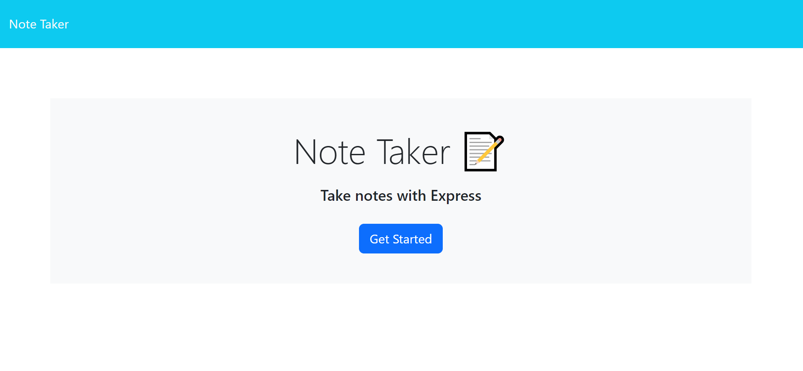
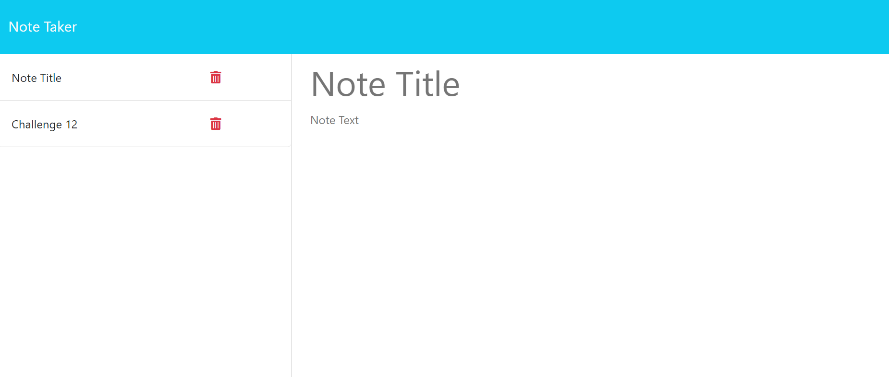
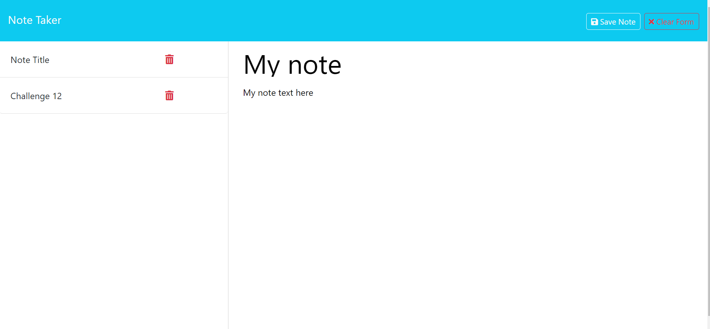

# Note Taker

A simple application that can be used to write and save notes. This application will use an Express.js back end and will save and retrieve note data from a JSON file.

## Description

The application can be simply described as a Note Taker that allows any user to creates notes which are saved in db.json file using the 'fs' module. The notes that are save can also be retrieved and displayed in the UI for the  user. The started code was given with the front-end code. 

The following animation demonstrates the application functionality: 

## Getting Started
The completed application looks like:

The notes page opens up when the user presses get started button on the homepage. The Notes page has two sections: Existing notes are listed on the left side and a section to add new notes on the right side. The notes page looks like the following image:

Once the user enters the Note title and note text, Save Note button and clear form button appears on the right hand side of the page as shown in the image below. The notes get saved once the user hits save button and appears along with the rest of the notes in the right section

The existing notes can also be deleted using the delete button along with the notes.
### Dependencies

* express 4.16.4
* uuid 8.3.2
* uuidv4 6.2.13

### Installing

* Application is deployed using render

### Executing program

* The application code can be cloned from the following Github link:
[GitHub-note-taker](https://github.com/aniraannu/note-taker)

## Help

NA

## Authors

Contributors names and contact info

Anira Raveendran
[@aniraannu](https://github.com/aniraannu)

## Version History

* 0.1
    * Initial Release

## License

None

## Acknowledgments

Inspiration, code snippets, etc.

* [dbader](https://github.com/dbader/readme-template)
